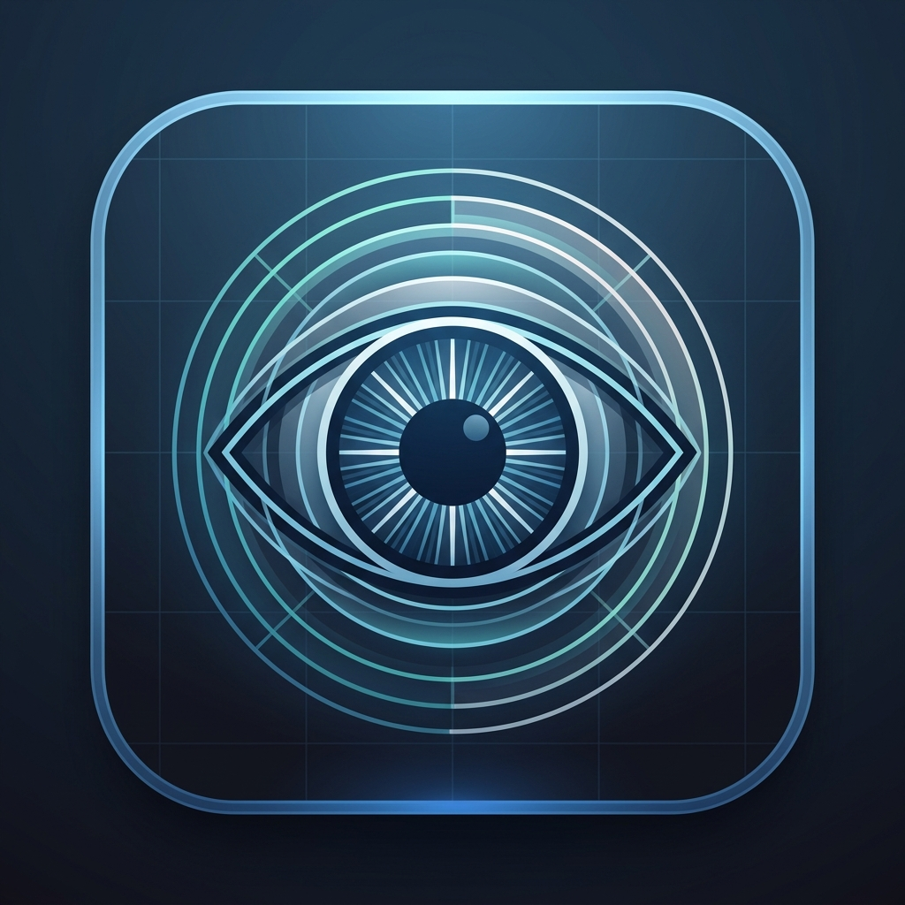

<div align="center">

# Kmax Display Example: 3D Eye Anatomy Exhibit



**A flagship interactive stereoscopic 3D showcase designed for Kmax light-field / fish-tank 3D displays.**

[](https://unity.com/)
[](https://unity.com/srp/universal-render-pipeline)
[](#kmax-sdk-backends)
[](#)

</div>

---

## Overview

**kmax-display-example** is an interactive, educational medical anatomy exhibit hosted inside the ViitorCloud Unity template and optimized for Kmax stereoscopic 3D display hardware.

The exhibit presents an anatomically accurate human eye in full stereoscopic depth. Users can view the assembled eye resting at the physical zero-parallax plane, smoothly explode its anatomical structures into an exploded assembly, select any of the 18 numbered anatomical hotspots to inspect individual structures in isolated focus, and navigate freely in 3D orbit around the model with mouse and keyboard.

---

## Features

- **Living 3D Stereoscopic Ambience**: Over 220 delicate luminous motes drift through the 3D volume around the eye, establishing real stereoscopic depth cues across the zero-parallax comfort zone from frame 0.
- **Subtle Numbered Interaction Badges**: 18 numbered medical badges (1 to 18) replace flashy markers. The badges feature a dark slate translucent disc, soft cyan rim, bold white typography, continuous camera billboarding, and gentle organic breathing oscillations.
- **Radiant Interaction Bursts**: Selecting any hotspot triggers an instant 45-particle golden stardust burst directly at the tapped 3D coordinates.
- **Centered Structure Focus**: Selecting any part isolates that structure, centers it at the display's dead center `(0, 0, 0)`, frames it for detailed inspection, fades the rest of the eye with a ghost material, and presents a clinical description in the slide-out info panel.
- **True Spherical Orbit Camera**: Full 3D camera navigation that mathematically locks the eye (or focused part) to the exact center of the screen (`viewport = (0.5000, 0.5000)`) at all times.
- **Unified 1st-Position Reset**: Clicking "Back" or "Reset View" (or pressing `R`) smoothly animates both the camera rig and the model back to their exact default starting poses over 0.45s.
- **Dual Kmax SDK Architecture**: Vendored with support for both Kmax XR Core 2.5.2 (default) and Kmax AIO K1 1.2.0, switchable via an editor menu with zero assembly reference errors.

---

## Navigation & Controls

The exhibit features an intuitive camera orbit flight system that prevents losing the model in 3D space:

| Input | Action | Behavior |
|---|---|---|
| **Left-Click Drag** | Orbit Camera | Smoothly rotates yaw and pitch around the eye's visual center. |
| **Right-Click Drag** | Orbit Camera | Smoothly rotates yaw and pitch around the eye's visual center. |
| **W / S** | Fly In / Out | Dollies the camera forward/backward along the viewing axis toward/away from the eye center. |
| **A / D** | Orbit Left / Right | Flies in an orbital circle left / right around the eye. |
| **Q / E** | Orbit Down / Up | Flies in an orbital elevation arc down / up around the eye. |
| **Arrow Keys** | Orbit View | Yaw (Left/Right) and pitch (Up/Down). |
| **Left Shift** | Flight Boost | 2.5x speed boost for all keyboard flight controls. |
| **Scroll Wheel** | Dolly Distance | Smoothly zooms in or out toward the focal center. |
| **"Back" Button** | Return to Overview | Exits part focus and smoothly restores both camera and model to the **1st starting position**. |
| **"Reset View" Button / R Key** | Home Reset | Smoothly animates camera and model back to the forward-facing default state. |
| **"Expand eye" / "Close eye"** | Assembly Toggle | Smoothly animates parts between assembled and exploded poses. |

> [!NOTE]
> Pitch is clamped between `-80°` and `+80°` to prevent disorientation and camera inversion. The model is locked to the center of the viewport across all angles.

---

## Anatomical Parts Catalog

The exhibit catalogues 18 distinct anatomical structures of the human eye:

| Index | Structure | Index | Structure |
|:---:|---|:---:|---|
| **1** | Cornea | **10** | Central retinal vein |
| **2** | Tear film | **11** | Superior vortex veins |
| **3** | Anterior chamber | **12** | Inferior vortex veins |
| **4** | Lens | **13** | Superior rectus |
| **5** | Uvea | **14** | Inferior rectus |
| **6** | Sclera | **15** | Medial rectus |
| **7** | Retinal vessels | **16** | Lateral rectus |
| **8** | Optic nerve | **17** | Superior oblique |
| **9** | Central retinal artery | **18** | Inferior oblique |

---

## Project Architecture

### Repository Boundary

This repository is a self-contained game module located at `Assets/Games/kmax-display-example/` inside the base project `unityvc-base-project`.

- **Base project** (`D:\Unity\kmax-display-example-base-project`) &mdash; **read-only**: Host template, package manifest, shared build scripts.
- **This module** (`Assets/Games/kmax-display-example/`) &mdash; **read/write**: All runtime code, scenes, shaders, materials, models, and module documentation.

### Kmax SDK Backends

Two Kmax SDK generations are vendored under `Plugins/Kmax/`. They are made mutually exclusive via the `KMAX_AIO_K1` compilation constraint:

| Backend | Package | Version | Platforms | Status |
|---|---|---|---|---|
| **Kmax XR Core** | `com.kmax.xr.core` | 2.5.2 | Windows Standalone, Android, Linux, macOS, WebGL | **Default (active)** |
| **Kmax AIO K1** | `com.kmax.xr.aio` | 1.2.0 | Windows Standalone, WSA | Opt-in |

To switch backends in the Unity Editor:
- Navigate to menu **Kmax > SDK Backend > XR Core 2.5.2** (or **AIO K1 1.2.0**).
- Switcher script `Scripts/Editor/KmaxSdkBackend.cs` safely toggles define constraints across build targets without broken assembly references.

### Dynamic Camera Resolution

The Kmax XR Core SDK instantiates stereo sub-cameras (`left` and `right`) under `XRRig/Camera` and disables the root `Camera` component. Because sub-cameras are untagged, standard `Camera.main` lookups return `null`. All exhibit scripts (`EyeHotspot`, `EyeAnatomyController`, `EyeManipulator`) query a dynamic resolver that checks `Camera.main` and falls back to `Camera.allCameras` to locate the active rendering camera.

---

## Directory Structure

```
Assets/Games/kmax-display-example/
├── Data/                       # ScriptableObject assets
│   ├── EyeAnatomyCatalog.asset # 18 labeled parts and clinical descriptions
│   └── EyeExplodePoses.asset   # Baked assembled and exploded transformation matrices
├── Images/                     # Visual branding assets
│   └── logo.png                # Eye Anatomy exhibit emblem
├── Materials/                  # URP transparent & unlit materials
│   ├── HotspotBadge.png        # Circular badge texture with slate disc and cyan accent
│   ├── HotspotBadge.mat        # Badge material
│   └── GhostPart.mat           # Material for fading non-focused structures
├── Model/                      # 3D assets
│   └── EyeAnatomy.glb          # High-polygon anatomical model imported via glTFast
├── Prefabs/                    # Reusable components
│   └── EyeHotspot.prefab       # Numbered billboarded badge with collider & TMP
├── Scenes/                     # Exhibit scenes
│   └── EyeAnatomy.unity        # Main interactive showcase scene
├── Scripts/
│   ├── Editor/                 # Editor tools (backend switcher, pose baker)
│   └── Runtime/                # Exhibit runtime controllers
│       ├── AnatomyInfoPanel.cs        # UI panel for part descriptions
│       ├── AnatomyParticleDirector.cs # Motes ambience and interaction burst control
│       ├── EyeAnatomyCatalog.cs       # Data schema for anatomical definitions
│       ├── EyeAnatomyController.cs    # Main exhibit coordinator & reset orchestrator
│       ├── EyeExplodePoseSet.cs       # Serialized pose definitions
│       ├── EyeExplodeView.cs          # Interpolation between assembled and exploded poses
│       ├── EyeFocusView.cs            # Single-part framing, isolation, and centering
│       ├── EyeHotspot.cs              # Billboarded numbered badge with breathing pulse
│       ├── EyeManipulator.cs          # Model pivot management and animated reset
│       ├── EyePartBounds.cs           # Accurate mesh bounds calculator
│       └── ViewerFlyController.cs     # Spherical orbit camera flight controller
└── docs/                       # Internal architecture and task documentation
    ├── ai_handoff.md           # Handoff briefing and hardware test checklist
    ├── architecture.md         # Detailed engine & SDK architecture
    ├── decisions.md            # Key architectural decisions & rationale
    ├── project-overview.md     # High-level overview
    ├── roadmap.md              # Future milestones
    └── tasks.md                # Detailed session logs
```

---

## Getting Started

### Prerequisites

- **Unity**: `6000.3.9f1` (or compatible Unity 6 release).
- **Render Pipeline**: Universal Render Pipeline (URP).
- **Target Hardware**: Kmax 3D Light-Field / Stereoscopic Display (or standard PC monitor in 2D preview mode).

### Opening the Project

1. Launch Unity Hub and open the base project at `D:\Unity\kmax-display-example-base-project`.
2. In the Project window, navigate to `Assets/Games/kmax-display-example/Scenes/`.
3. Open `EyeAnatomy.unity`.
4. Press **Play** in the Unity Editor.
   - The assembled eye will appear centered at zero-parallax.
   - Ambient motes will float gently across depth planes.
   - Click **Expand eye** to expand the structures and reveal the 18 numbered badges.
   - Drag with left or right mouse button or use **W / A / S / D** to orbit around the eye.
   - Click any badge to focus and inspect that structure.
   - Click **Back** to return to overview at the starting pose.

---

## Documentation

For in-depth technical documentation, refer to the [`docs/`](docs/) directory:
- [Architecture](docs/architecture.md) &mdash; Detailed assembly design, URP pipeline integration, and Kmax SDK switcher.
- [Decisions](docs/decisions.md) &mdash; Architectural log covering orbit camera geometry, centering logic, and billboarding.
- [Tasks](docs/tasks.md) &mdash; Chronological changelog across development sessions.
- [AI Handoff](docs/ai_handoff.md) &mdash; Deployment guide and hardware verification steps.

---

<div align="center">
  <sub>Developed with Google Antigravity for ViitorCloud & Kmax 3D Technologies.</sub>
</div>